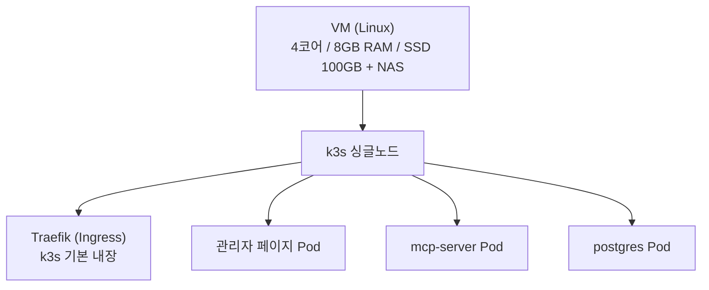
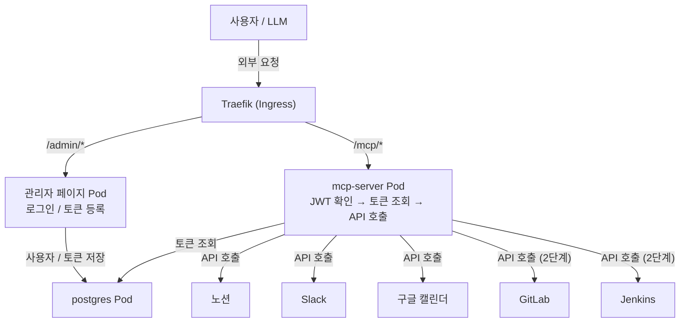
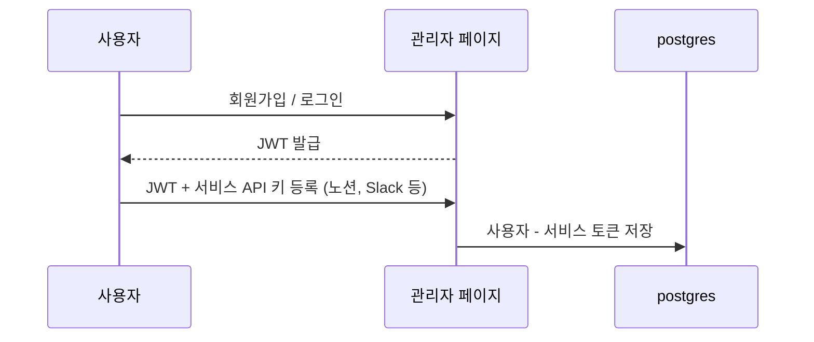
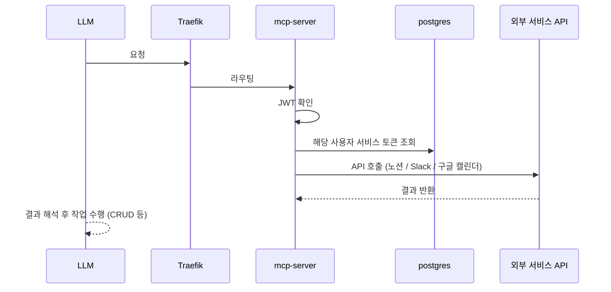
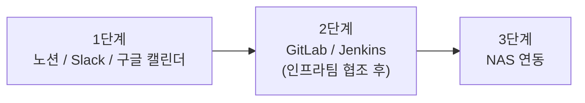

# k3s 구성 설계 (POC)

## 전체 구조

---

## 전체 흐름도 (Ingress 기준)

---

## Pod 구성

| Pod | 역할 |
|-----|------|
| 관리자 페이지 | 사용자 로그인, 서비스 토큰 등록 UI |
| DB (postgres) | 사용자 정보, 서비스 토큰 저장 |
| MCP 서버 | JWT 확인 → DB에서 토큰 꺼냄 → 외부 API 호출 |
| Traefik | k3s 내장, 외부 요청 라우팅 (따로 관리 불필요) |

---

## 요청 흐름

### 최초 연동 (관리자 페이지)

### 실제 MCP 요청

---

## 역할 분리

| 주체 | 역할 |
|------|------|
| MCP 서버 | API 연결 도구 제공 |
| LLM | 판단 + 실제 작업 수행 (CRUD 등) |

실제 작업(생성/수정/삭제)은 LLM이 판단해서 수행 — MCP 서버는 API 연결만 담당

---

## Kubernetes 리소스

| 리소스 | 용도 |
|--------|------|
| Deployment | 관리자 페이지, mcp-server, postgres |
| Service | 내부 통신용 ClusterIP |
| Ingress | 외부 접근 (Traefik) |
| Secret | API 키 (노션, Slack, 구글 캘린더) |
| ConfigMap | 서버 설정값 |
| PersistentVolumeClaim | postgres 데이터 저장 (SSD) |

---

## RAM 배분 (예상)

| 용도 | 사용량 |
|------|--------|
| OS/시스템 | ~1GB |
| k3s | ~512MB |
| 관리자 페이지 | ~512MB |
| mcp-server | ~1GB |
| postgres | ~512MB |
| 여유 | ~4.5GB |

---

## POC 범위

