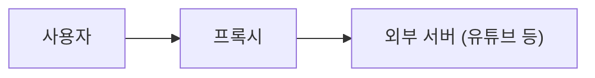
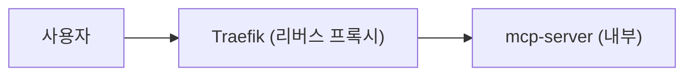

# 프록시 vs 리버스 프록시

## 프록시 (포워드 프록시)

- 내가 직접 유튜브 접속하면 내 IP가 노출됨
- 프록시 쓰면 프록시 IP로 접속 → **내 신분 숨김**

## 리버스 프록시

- 사용자가 mcp-server에 직접 접속하면 서버 주소 노출됨
- Traefik이 앞에서 대신 받음 → **서버 신분 숨김**

## 핵심 차이

앞에서 막아주는 대상이 **사용자냐 서버냐** 차이

| | 프록시 | 리버스 프록시 |
|---|---|---|
| 숨기는 대상 | 사용자 | 서버 |
| 대신 하는 것 | 요청을 나가게 | 요청을 받아줌 |
| 예시 | VPN | Traefik, Nginx |
