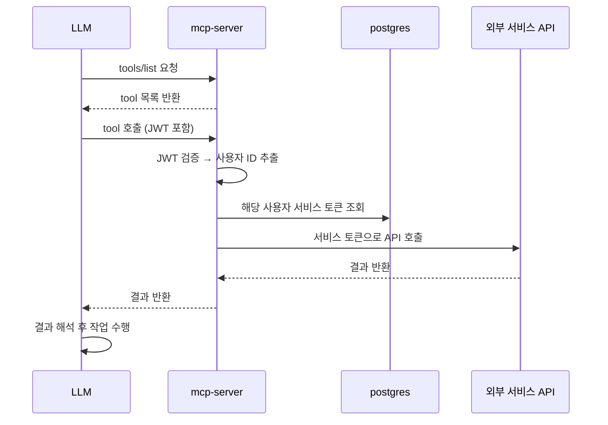

# MCP 서버 구조 및 동작

## MCP 서버란

LLM을 위한 API 서버. LLM이 외부 서비스를 사용할 수 있도록 도구(tool)를 제공함.

---

## 핵심 원칙

**MCP 서버도 결국 API 통신이다.**

```
앱이 API 제공 O → MCP tool 만들 수 있음
앱이 API 제공 X → MCP tool 만들 수 없음
```

MCP 서버가 마법처럼 앱에 접근하는 게 아니라, 각 앱이 열어준 API를 호출하는 구조.

---

## 통신 방식

| | REST API | MCP 서버 |
|---|---|---|
| 호출 주체 | 사람 / 앱 | LLM |
| 통신 방식 | HTTP | JSON-RPC |
| 응답 형태 | JSON | LLM이 이해할 수 있는 형태 |

---

## Tool 동작 방식

### Tool 목록 조회 (자동 discovery)

```
1. LLM이 MCP 서버에 먼저 물어봄 (tools/list 호출)
   "너 어떤 tool 갖고 있어?"

2. MCP 서버가 tool 목록 + 설명 + 파라미터 반환
   [notion_search, slack_send, calendar_get ...]

3. LLM이 목록 보고 판단
   "사용자 요청에 맞는 tool이 뭔지 결정"

4. Tool 호출
```

LLM이 tool을 자동으로 아는 게 아니라, MCP 서버가 먼저 목록을 알려주는 구조.

### Tool 예시 (FastMCP)

```python
@mcp.tool()
def notion_search(query: str):
    return notion_api.search(query)

@mcp.tool()
def slack_send(channel: str, message: str):
    return slack_api.send(channel, message)
```

---

## MCP 서버 내부 흐름



---

## 실제 사용 예시 (노션)

```
사용자: "회의록 페이지 찾아서 오늘 내용 넣어줘"

LLM 내부 판단:
  1. notion_search("회의록") 호출
  2. 결과에서 페이지 ID 확인
  3. notion_update(page_id, 오늘 내용) 호출

사용자: 결과만 받음 (tool 호출 과정은 보이지 않음)
```

뭘 검색할지, 몇 번 tool을 호출할지는 LLM이 판단. MCP 서버는 창구 역할만.

---

## Tool 설계 원칙

Tool은 **기능(CRUD) 단위**로 만들고, 대상과 내용은 LLM이 결정한다.

```
notion_search(query)            ← 조회
notion_update(page_id, content) ← 수정
notion_create(title, content)   ← 생성
notion_delete(page_id)          ← 삭제
```

- 회의록, 게시판 같은 데이터 단위로 tool을 만드는 게 아님
- "검색"이라는 기능 하나 = tool 하나
- Tool은 3~5개면 충분

---

## Tool 접근 범위 제한

Tool을 통해서만 LLM이 외부 서비스에 접근 가능. 직접 API 호출은 불가.

제한 방법 두 가지:

**1. API 키 권한으로 제한**
- API 키 발급 시 접근 가능한 페이지/DB 범위 설정
- 노션의 경우 integration 설정에서 접근 범위 지정

**2. Tool 파라미터로 제한**
```python
@mcp.tool()
def notion_search(query: str):
    # database_id 고정 → 특정 DB만 검색하도록 제한
    return notion_api.search(query, database_id="고정값")
```

각 앱의 API 문서를 보고 뭘 제한할 수 있는지 먼저 확인 필요. API가 지원하는 범위 안에서만 제한 가능.

---

## 직접 만든 MCP 서버의 보안 이점

외부 공개 MCP 서버는 권한 범위가 넓어 LLM이 마음대로 삭제/수정 가능 → 위험

직접 만든 MCP 서버는 우리가 열어준 tool만 사용 가능:

```
notion_delete 안 만들면  → LLM이 삭제 불가
notion_search만 만들면  → 조회만 가능
```

**Tool을 어떻게 만드냐에 따라 LLM이 할 수 있는 행동 범위가 결정된다.**

---

## API 없는 서버 연동 (SSH Tool)

API를 제공하지 않는 개발서버는 SSH로 직접 접속해서 리눅스 명령어로 tool 만들기 가능.

```python
@mcp.tool()
def server_disk_usage(server: str):
    # SSH로 해당 서버 접속 후 df -h 실행
    result = ssh.execute(server, "df -h")
    return result
```

```
사용자: "개발서버 디스크 확인해줘"
→ LLM: server_disk_usage("dev-server-01") 호출
→ MCP 서버가 SSH로 접속 → df -h 실행
→ 결과 반환
```

SSH 접근 권한만 있으면 API 없어도 연동 가능. 단, SSH 키/계정은 인프라팀한테 받아야 함.

LLM이 직접 SSH 접속하는 게 아님. SSH 접속은 MCP 서버가 하고 LLM은 tool 호출만 함. SSH 키/계정도 MCP 서버가 보유.

---

## 클라우드 서비스 연동 (구글 캘린더 예시)

로컬에 설치된 앱과 연동하는 게 아니라 **클라우드 서버에 직접 API로 접근.**

```
구글 캘린더 서버 (클라우드)
       ↑
로컬 앱 (조회용 클라이언트)    MCP 서버 (API로 직접 접근)
```

로컬 앱은 구글 캘린더 서버의 데이터를 보기 편하게 보여주는 클라이언트일 뿐. MCP 서버도 동일하게 구글 캘린더 서버에 직접 접근. OAuth 키만 있으면 됨.

---

## 프레임워크

| | Python (FastMCP) | TypeScript SDK |
|---|---|---|
| 공식 지원 | Anthropic 공식 통합 | 공식 지원 |
| 코드량 | 최소 | 보통 |
| 추천 | POC에 적합 | - |

Kotlin 공식 SDK 없음 → POC에 부적합

**추천 구성:**
- 관리자 페이지 → Kotlin (Spring Boot)
- MCP 서버 → Python (FastMCP)
